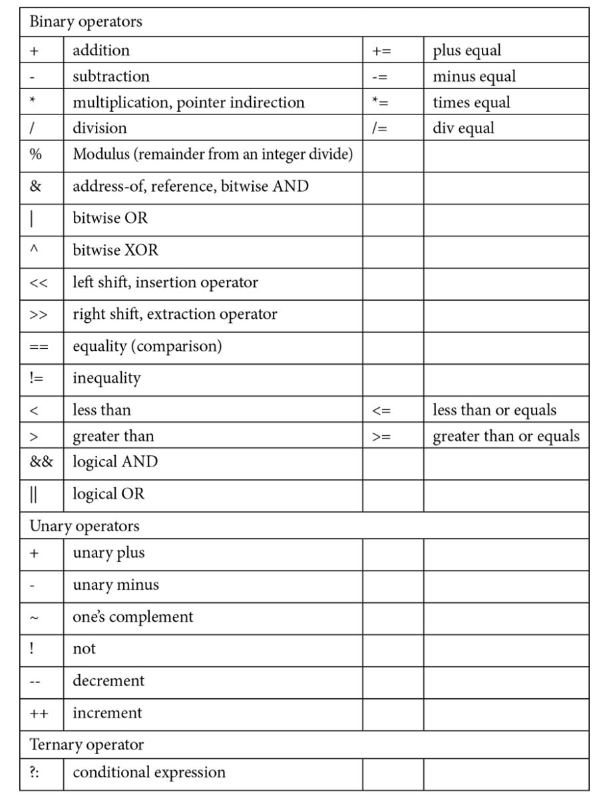

# Chapter 1 - Understanding Basic C++ Assumptions

## Reviewing basic C++ language syntax

### Comment styles

The two most common are:

- ```cpp /* */``` for multiple lines.
- ```cpp //``` for single lines.

### Variable declarations and standard data types

Variables may be of any length, and may consist of letters, digits, and underscores. Variables are case
sensitive and must begin with a letter or an underscore. Standard data types in C++ include the following:

- int: to store whole numbers
- float: to store floating point numbers
- double: to store double precisiton floating point numbers
- char: to store a single character
- bool: for boolean values of true or false

An example in action:

```cpp
int x = 5;
int a = x;
float y = 9.87;
float y2 = 10.76f; // optional 'f' suffix on float literal
float b = y;
double yy = 123456.78;
double c = yy;
char z = 'Z';
char d = z;
bool test = true;
bool e = test;
bool f = !test;
```

### Variables and array basics

Arrays can be declared of any data type. The array name represents the starting address of the
contiguous memory associated with the array’s contents. Arrays are zero-based in C++, meaning they
are indexed starting with array element[0] rather than array element[1]. Most importantly,
range checking is not performed on arrays in C++; if you access an element outside the size of an array,
you are accessing memory belonging to another variable, and your code will likely fault very soon.

```cpp
char name[10] = "Dorothy"; // size is larger than needed
float grades[20]; // array is not initialized; caution!
grades[0] = 4.0; // assign a value to one element of array
float scores[] = {3.3, 4.3, 4.0, 3.7}; // initialized array
```

Arrays of characters are often conceptualized as strings. Many standard string functions exist in
libraries such as ```<cstring>```. Arrays of characters should be null-terminated if they are to be treated
as strings. When arrays of characters are initialized with a string of characters, the null character is
added automatically. However, if characters are added one by one to the array via assignment, it would
then be the programmer’s job to add the null character ('\0') as the final element in the array.
In addition to strings implemented using arrays of characters (or a pointer to characters), there is a
safer data type from the C++ Standard Library, std::string. We will understand the details of
this type once we master classes in Chapter 5, Exploring Classes in Detail; however, let us introduce
string now as an easier and less error-prone way to create strings of characters. You will need to
understand both representations; the array of char (and pointer to char) implementations will
inevitably appear in C++ library and other existing code. Yet you may prefer string in new code
for its ease and safety.

```cpp
// size of array can be calculated by initializer
char book1[] = "C++ Programming";
char book2[25]; // this string is uninitialized; caution!
// use caution as to not overflow destination (book2)
strcpy(book2, "OO Programming with C++");
strcmp(book1, book2);
length = strlen(book2);
string book3 = "Advanced C++ Programming"; // safer usage
string book4("OOP with C++"); // alt. way to init. string
string book5(book4); // create book5 using book4 as a basis
```

## Recapping basic I/O

### The iostream library

One of the easiest mechanisms for input and output in C++ is the use of the ```<iostream>``` library.
The header file ```<iostream>``` contains definitions of data types istream and ostream. Instances of
these data types, cin, cout, cerr, and clog, are incorporated by including the std namespace.
The ```<iostream>``` library facilitates simple I/O and can be used as follows:
- cin can be used in conjunction with the extraction operator >> for buffered input
- cout can be used in conjunction with the insertion operator << for buffered output
- cerr (unbuffered) and clog (buffered) can also be used in conjunction with the insertion
operator, but for errors

```cpp
#include <iostream>
using namespace std; // we'll limit the namespace shortly
int main()
{
    char name[20]; // caution, uninitialized array of char
    int age = 0;
    cout << "Please enter a name and an age: ";
    cin >> name >> age; // caution, may overflow name var.
    cout << "Hello " << name;
    cout << ". You are " << age << " years old." << endl;
    return 0;
}
```

### Basic iostream manipulators

Often, it is desirable to be able to manipulate the contents of the buffers associated with cin, cout,
and cerr. Manipulators allow the internal state of these objects to be modified, which affects how
their associated buffers are formatted and manipulated. Manipulators are defined in the <iomanip>
header file. Common manipulator examples include the following:
- endl: Places a newline character ('\n') in the buffer associated with cout then flushes the
buffer
- flush: Clears the contents of the output stream
- setprecision(int): Defines the precision (number of digits) used to output floating
point numbers
- setw(int): Sets the width for input and output
- ws: Removes whitespace characters from the buffer

Let's see an example:

```cpp
#include <iostream>
#include <iomanip>
using namespace std; // we'll limit the namespace shortly
int main()
{
    char name[20]; // caution; uninitialized array
    float gpa = 0.0; // grade point average
    cout << "Please enter a name and a gpa: ";
    cin >> setw(20) >> name >> gpa; // won't overflow name
    cout << "Hello " << name << flush;
    cout << ". GPA is: " << setprecision(3) << gpa << endl;
    return 0;
}
```

## Revisiting control structures, statements, and looping

C++ has a variety of control structures and looping constructs that allow for non-sequential program
flow. Each can be coupled with simple or compound statements. Simple statements end with a
semicolon; more compound statements are enclosed in a block of code using a pair of brackets {}.
In this section, we will be revisiting various types of control structures (if, else if, and else),
and looping constructs (while, do while, and for) to recap simple methods for non-sequential
program flow within our code.

### Control structures – if, else if, and else

Conditional statements using if, else if, and else can be used with simple statements or a block
of statements. Note that an if clause can be used without a following else if or else clause.
Actually, else if is really a condensed version of an else clause with a nested if clause inside
of it. Practically speaking, developers flatten the nested use into else if format for readability and
to save excess indenting. Let’s see an example:

```cpp
#include <iostream>
using namespace std; // we'll limit the namespace shortly
int main()
{
    int x = 0;
    cout << "Enter an integer: ";
    cin >> x;
    if (x == 0)
        cout << "x is 0" << endl;
    else if (x < 0)
        cout << "x is negative" << endl;
    else
    {
        cout << "x is positive";
        cout << "and ten times x is: " << x * 10 << endl;
    }
return 0;}
```

### Looping constructs – while, do while, and for loops

C++ has several looping constructs. Let’s take a moment to review a brief example for each style,
starting with the while and do while loop constructs:

```cpp
#include <iostream>
using namespace std; // we'll limit the namespace shortly
int main()
{
    int i = 0;
    while (i < 10)
    {
        cout << i << endl;
        i++;
    }
    i = 0;
    do
    {
        cout << i << endl;
        i++;
    } while (i < 10);
    return 0;
}
```

Next, let’s review a typical for loop.

```cpp
#include <iostream>
using namespace std; // we'll limit the namespace shortly
int main()
{
    // though we'll prefer to declare i within the loop
    // construct, let's understand scope in both scenarios
    int i;
    for (i = 0; i < 10; i++)
    cout << i << endl;
    for (int j = 0; j < 10; j++) // preferred declaration
    cout << j << endl; // of loop control variable
    return 0;
}
```

Let’s quickly see an example using nested loops. 

```cpp
#include <iostream>
using namespace std; // we'll limit the namespace shortly
int main()
{
    for (int i = 0; i < 10; i++)
    {
        cout << i << endl;
        for (int j = 0; j < 10; j++)
        cout << j << endl;
        cout << "\n";
    }
    return 0;
}
```

## Reviewing C++ operators

Unary, binary, and ternary operators exist in C++. C++ allows operators to have different meanings
based on the context of usage. C++ also allows programmers to redefine the meaning of selected
operators when used in the context of at least one user defined type. The operators are listed in the
following concise list. We’ll see examples of these operators throughout the remainder of this section
and throughout the course. Here is a synopsis of the binary, unary, and ternary operators in C++:


Let’s take a look at an example that incorporates an assortment
of operators, including the usage of a shortcut operator:

```cpp
score += 5;
score++;
if (score == 100)
    cout << "You have a perfect score!" << endl;
else
    cout << "Your score is: " << score << endl;
    // equivalent to if - else above, but using ?: operator
    (score == 100)? cout << "You have a perfect score" << endl:
    cout << "Your score is: " << score << endl;
```

## Revisiting function basics
A function identifier must begin with a letter or underscore and may also contain digits. The function’s
return type, argument list, and return value are optional. The basic form of a C++ function is as follows:
```cpp
<return type> FunctionName (<argumentType argument1, …>)
{
    expression 1…N;
    <return value/expression;>
}
```
Let’s review a simple function:
```cpp
#include <iostream>
using namespace std; // we'll limit the namespace shortly
int Minimum(int a, int b)
{
    if (a < b)
        return a;
    else
        return b;
}
int main()
{
    int x = 0, y = 0;
    cout << "Enter two integers: ";
    cin >> x >> y;
    cout << "The minimum is: " << Minimum(x, y) << endl;
    return 0;
}
```

> **_Important Note:_**  The specifier [[nodiscard]] can optionally be added to precede the return type of a function.
This specifier is used to indicate that the return value from a function must not be ignored – that
is, it must be captured in a variable or utilized in an expression. Should the function’s return
value consequently be ignored, a compiler warning will be issued. Note that the nodiscard
qualifier can be added to the function prototype and optionally to the definition (or required
in a definition if there is no prototype). Ideally, nodiscard should appear in both locations.

## Reviewing user defined type basics

### struct
A C++ structure in its simplest form can be used to collect common data elements together in a single
unit. Variables may then be declared of the composite data type. The dot operator is used to access
specific members of each structure variable. Here is a structure used in its most simple fashion:
```cpp
#include <iostream>
using namespace std; // we'll limit the namespace shortly
struct student
{
    string name;
    float semesterGrades[5];
    float gpa;
};
int main()
{
    student s1;
    s1.name = "George Katz";
    s1.semesterGrades[0] = 3.0;
    s1.semesterGrades[1] = 4.0;
    s1.gpa = 3.5;
    cout << s1.name << " has GPA: " << s1.gpa << endl;
    return 0;
}
```

### typedef and “using” alias declaration
A typedef declaration can be used to provide a more mnemonic representation for data types. In
C++, the relative need for a typedef has been eliminated in usage with a struct. Historically, a
typedef in C allowed the bundling together of the keyword struct and the structure tag to create
a user defined type. However, in C++, as the structure tag automatically becomes the type, a typedef
then becomes wholly unnecessary for a struct. 

```cpp
typedef float dollars;
using money = float;
```

### class
A class in its simplest form can be used nearly like a struct to bundle together related data
into a single data type. In Chapter 5, Exploring Classes in Detail, we’ll see that a class is typically
also used to bundle related functions together with the new data type. Grouping together data and
behaviors relevant to that data is the basis of encapsulation. For now, let’s see a class in its simplest
form, much like a struct:
```cpp
#include <iostream>
using namespace std; // we'll limit the namespace shortly
class Student
{
    public:
    string name;
    float semesterGrades[5];
    float gpa;
};
int main()
{
    Student s1;
    s1.name = "George Katz";
    s1.semesterGrades[0] = 3.0;
    s1.semesterGrades[1] = 4.0;
    s1.gpa = 3.5;
    cout << s1.name << " has GPA: " << s1.gpa << endl;
    return 0;
}
```

### enum and strongly-typed enum

Traditional enumerated types may be used to mnemonically represent lists of integers. Unless otherwise
initialized, integer values in the enumeration begin with zero and increase by one throughout the list.
Two enumerated types may not utilize the same enumerator names.
Strongly-typed enumerated types improve upon traditional enumerated types. Strongly-typed enums
default to represent lists of integers, but may be used to represent any integral type, such as int, short
int, long int, char, or bool. The enumerators are not exported to the surrounding scope, so
enumerators may be reused between types. Strongly-typed enums allow forward declarations of their
type (allowing such uses as these types as arguments to functions before the enumerator declaration).

```cpp
#include <iostream>
using namespace std; // we'll limit the namespace shortly
// traditional enumerated types
enum day {Sunday, Monday, Tuesday, Wednesday, Thursday,
Friday, Saturday};
enum workDay {Mon = 1, Tues, Wed, Thurs, Fri};

// strongly-typed enumerated types can be a struct or class
enum struct WinterHoliday {Diwali, Hanukkah, ThreeKings,
WinterSolstice, StLucia, StNicholas, Christmas, Kwanzaa};
enum class Holiday : short int {NewYear = 1, MLK, Memorial,
Independence, Labor, Thanksgiving};

int main()
{
    day birthday = Monday;
    workDay payday = Fri;
    WinterHoliday myTradition = WinterHoliday::StNicholas;
    Holiday favorite = Holiday::NewYear;
    cout << "Birthday is " << birthday << endl;
    cout << "Payday is " << payday << endl;
    cout << "Traditional Winter holiday is " <<
    static_cast<int> (myTradition) << endl;
    cout << "Favorite holiday is " <<
    static_cast<short int> (favorite) << endl;
    return 0;
}
```

## Recapping namespace basics

The namespace utility was added to C++ to add a scoping level beyond global scope to applications.
This feature can be used to allow two or more libraries to be utilized without concern that they may
contain duplicative data types, functions, or identifiers. The programmer needs to activate the desired
namespace in each relevant portion of their application with the keyword using. Programmers
can also create their own namespaces (usually for creating reusable library code) and activate each
namespace as applicable. In the previous examples, we’ve seen the simple use of the std namespace
to include cin and cout, which are instances of istream and ostream (whose definitions are
found in ```<iostream>```).

```cpp
#include <iostream>
// using namespace std; // Do not open entire std namespace
using std::cout; // Instead, activate individual elements
using std::endl; // within the namespace as needed

namespace DataTypes
{
    int total;
    class LinkList
    { // full class definition …
    };

    class Stack
    { // full class definition …
    };
};

namespace AbstractDataTypes
{
    class Stack
    { // full class definition …
    };
    class Queue
    { // full class description …
    };
};

// Add entries to the AbstractDataTypes namespace
namespace AbstractDataTypes
{
    int total;
    class Tree
    { // full class definition …
    };
};

int main()
{
    using namespace AbstractDataTypes; //activate namespace
    using DataTypes::LinkList; // activate only LinkList
    LinkList list1; // LinkList is found in DataTypes

    Stack stack1; // Stack is found in AbstractDataTypes
    total = 5; // total from active AbstractDataTypes
    DataTypes::total = 85;// specify non-active mbr., total
    cout << "total " << total << "\n";
    cout << "DataTypes::total " << DataTypes::total;
    cout << endl;
    return 0;
}
```
It is considered good practice to activate only the elements of a namespace we wish to utilize. From
the aforementioned example, we can see potential ambiguity that can otherwise arise.

## Summary
In this chapter, we reviewed core C++ syntax and non-OO language features to refresh your existing
skill set. These features include basic language syntax, basic I/O with <iostream>, control structures/
statements/looping, operator basics, function basics, simple user defined types, and namespaces.
Most importantly, you are now ready to move to the next chapter, in which we will expand on some
of these ideas with additional language necessities such as const qualified variables, understanding
and using prototypes (including with default values), and function overloading.
The ideas in the next chapter begin to move us closer to our goal for OO programming, as many of
these aggregate skills are used often and matter of factly as we move deeper into the language. It is
important to remember that in C++, you can do anything, whether you mean to do so or not. There
is great power in the language, and having a solid base for its many nuances and features is crucial.
Over the next couple of chapters, the solid groundwork will be laid with an arsenal of non-OO C++
skills, so that we may realistically engage OO programming in C++ with a high level of understanding
and success.